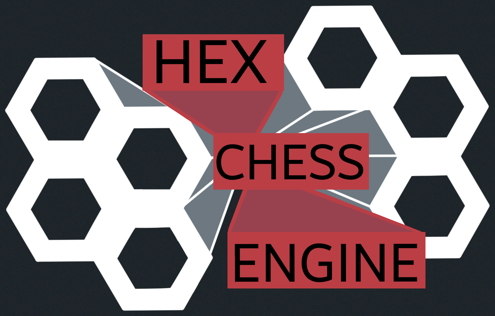
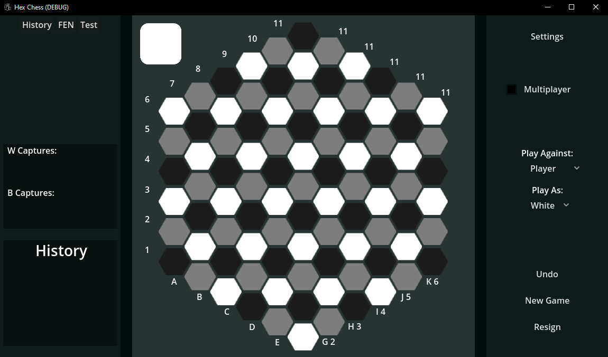
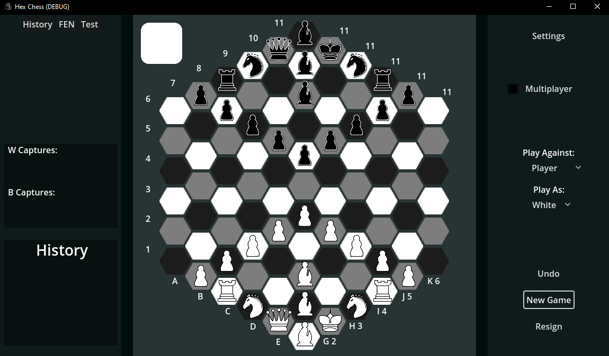

# HexChess Engine

[//]: # ( EX. LB. Hexagonal Chess Banner RB. LP. path_to_banner_image RP. )



A Simple twist on chess, its played on a hexagonal board. 

## Table of Contents
- [Features](#features)
- [TryItYourself](#TryItYourself)
- [Controls](#controls)
- [Gameplay](#gameplay)
- [License](#license)

## Features
- Drag and Drop or Click and Drag.

## TryItYourself

1. **Clone the repository**:
    ```bash
    git clone https://github.com/leothecrz/GodotHexChess.git
    cd GodotHexChess
    ```

2. **Open the project in Godot**:
    - Open your Godot engine.
    - Click on "Import", select the `project.godot` file from the cloned directory.

3. **Run the project**:
    - Click on the play button to launch the game.

## Controls
- **Mouse**: 
	- (WIP)
- **Keyboard Shortcuts**:
    - (WIP)
  
## Gameplay



Hexagonal Chess follows most of the traditional chess rules with a couple caveats:
- Each piece’s movement is adapted to fit a hexagonal grid.
	- PAWN: Moves 1 Hex towards the opponent. Can attack 1 Hex to either opponent facing diagonals.  
	- KNIGH : Moves in 'L' shape JUMPS from staring hex. 2 edge touching hex straight, and 1 one to either diagonal on the facing away from the start HEX.
	- BISHOP : Moves any number of Hex on the the straight lines from the vertexes of starting Hex. Moves along the same color.
	- ROOK : Moves any number Hex on the edge touching straigh lines from the starting Hex.
	- QUEEN: Has both ROOK and BISHOP moves.
	- KING : Moves 1 Hex to all 6 edge touching Hex and to all Hex 1 vetex line away.
- 



### Rules Overview:
- Each player takes turns to move one piece.
- Check and checkmate mechanics remain the same.
- There is no castling
- If a pawn captures and lands on one of the starting pawn positions it retains its ability two move 2 Hex foward.
-

### Folder Structure:


## License


## Contributions
By : LeothEcRz